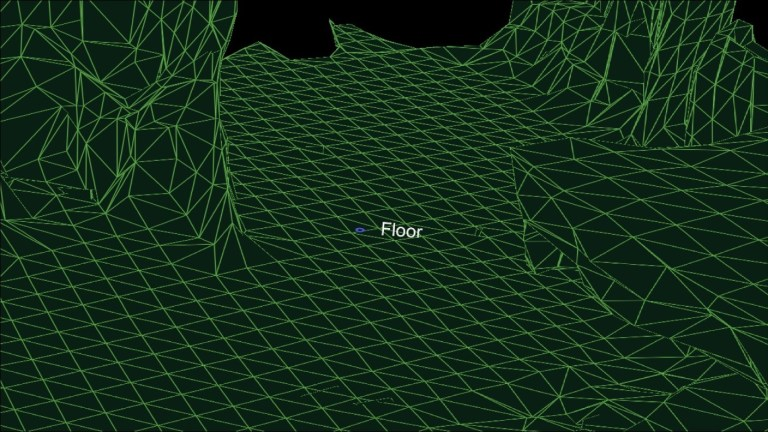

  
# Plane Detection with HoloLens

App for detecting flat objects in Mesh created with HoloLens AR glasses.

## Usage

Checkout the code example in DemoSpatialMeshHandler.cs file.

## Planes

## License
[MIT](https://choosealicense.com/licenses/mit/)
